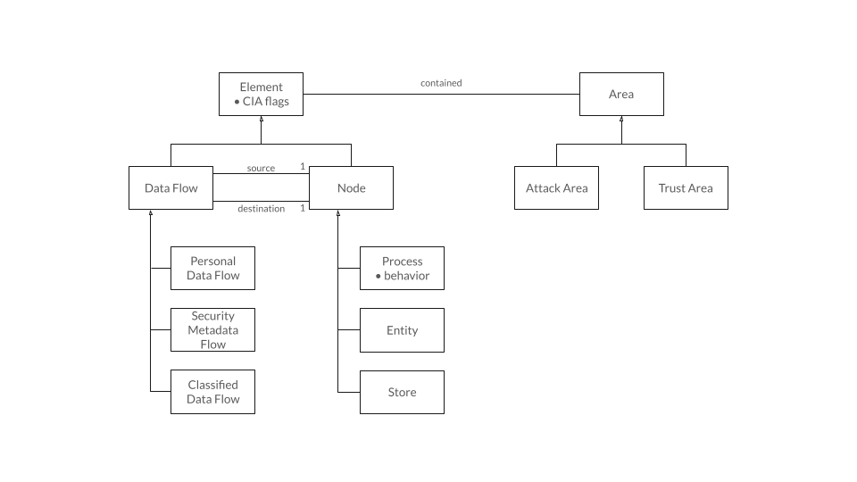
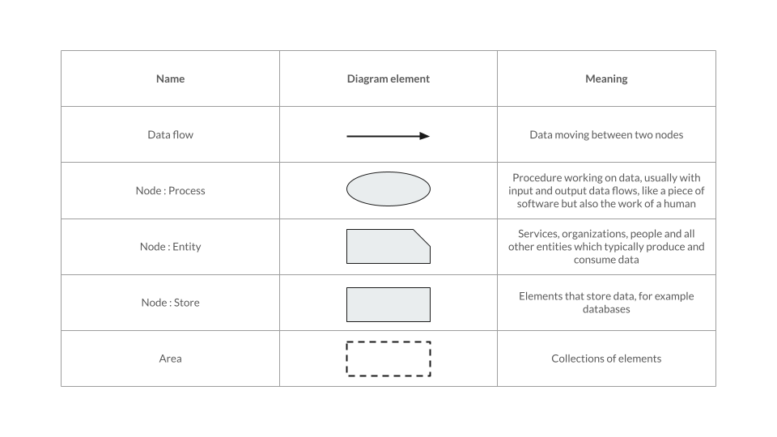
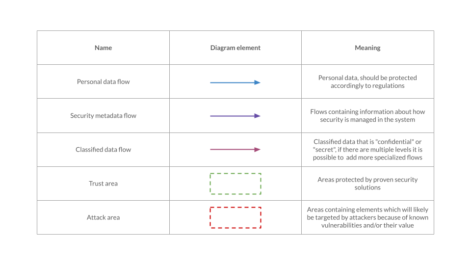
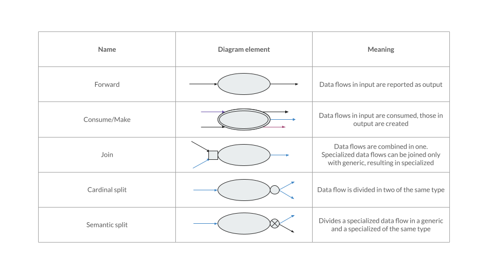

# Governance Data Flow Diagrams for the Italian National Framework for Cybersecurity and Data Protection

This repository contains all the material needed to support the Italian National Framework for Cybersecurity and Data Protection with Governance Data Flow Diagrams. For more details plese refer to the full [thesis](Mignano_Fulvio_Pio_Thesis.pdf).

**Table of contents:**
- [Governance Data Flow Diagrams for the Italian National Framework for Cybersecurity and Data Protection](#governance-data-flow-diagrams-for-the-italian-national-framework-for-cybersecurity-and-data-protection)
  - [Governance Data Flow Diagrams](#governance-data-flow-diagrams)
    - [Relationships between components:](#relationships-between-components)
    - [Graphical representations:](#graphical-representations)
  - [Security Templates](#security-templates)
  - [controlExtractor](#controlextractor)
    - [Dependencies](#dependencies)
    - [Usage](#usage)
    - [Control Extraction Rules](#control-extraction-rules)

## Governance Data Flow Diagrams

Governance Data Flow Diagrams (GDFD) are an extended version of regular Data Flow Diagrams. Each GDFD contains Nodes connected by Data Flows. Sets of Elements can be contained by Areas. Both Elements and Areas can be specialized depending on their meaning. In addition Processes, a type of Nodes, have a behavior which dictates the relations between Data Flows in input and in output.

### Relationships between components:

### Graphical representations:

## Security Templates

Security Templates are pre-made GDFDs which offer an example of compliance with one or more security objectives. The *Security-Templates-PNG* and *Security-Templates-JSON* directories contain, in human readable and computer friendly format respectively, Security Templates for all subcategories of the Italian National Framework for Cybersecurity and Data Protection which support them.

In those directories files are organized as in the Framework, with functions containing categories and categories containing subcategories.

## controlExtractor
The controlExtractor tool is capable of extracting automatically security controls from Security Templates in JSON format. It has been designed specifically to work with Security Templates corresponding to subcategories of the Italian National Framework for Cybersecurity and Data Protection.

### Dependencies
The controlExtractor tool requires the following Python packages:
- openpyxl: https://pypi.org/project/openpyxl/
- natsort: https://pypi.org/project/natsort/

### Usage

**Basic usage:**

Edit *config.JSON* to select which rules to use setting their value to *true*, then run:

`
python controlExtractor.py <security_templates_path> <output_xlsx_path>
`

<security_templates_path> must respect the structure of the *Security-Templates-JSON* directory and subdirectories, but it is possible to remove any unwanted function, category or subcategory by deleting the corresponding files.

<output_xlsx_path> does not have to be an existing xlsx file. If the file exists it will be overwritten, otherwise it will be created.

**Quick Start**

To use controlExtractor:
1. Select from the Framework the set of subcategories for control extraction;
2. Edit *config.JSON* to select which rules to use for extraction;
3. Delete all the JSON files corresponding to unselected subcategories from *Security-Templates-JSON*;
4. Run the following command;

`
python controlExtractor.py Security-Templates-JSON output.xlsx
`

**Additional options**

Run the tool with the *-n* flag to generate controls without IDs (useful for detecting duplicates).

`
python controlExtractor.py <security_templates_path> <output_xlsx_path> -n
`
### Control Extraction Rules

Brief explanation of the rules in *config.JSON*.
- nodeExist -> creates a control requiring the existance of each Process and Data Store;
- nodeC -> creates a control for each Node with confidentiality requirements;
- nodeI -> creates a control for each Node with integrity requirements;
- nodeA -> creates a control for each Node with availability requirements;
- nodeCIA -> applies nodeC, nodeI and nodeA but creates a single control per node;
- flowExist -> creates a control requiring the existance of each Data Flow;
- flowC -> creates a control for each Data Flow with confidentiality requirements;
- flowI -> creates a control for each Data Flow with integrity requirements;
- flowA -> creates a control for each Data Flow with availability requirements;
- flowP -> creates a control for each Personal Data Flow;
- flowCIAP -> applies flowC, flowI, flowA and flowP but creates a single control per Data Flow;
- areaExist -> creates a control requiring the existance of each Area;
- areaTrust -> creates a control for each Trust Area;
- areaFlowsEnter -> creates a control for each Data Flow entering inside an Area;
- areaFlowsExit -> creates a control for each Data Flow exiting from an Area;

It is suggested not to activated nodeCIA and either nodeC, nodeI and/or nodeA at the same time to avoid redundancy. The same suggestion is true for flowCIAP and flowC, flowI, flowA, flowP.